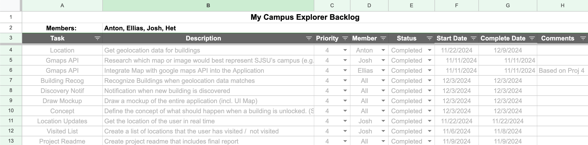
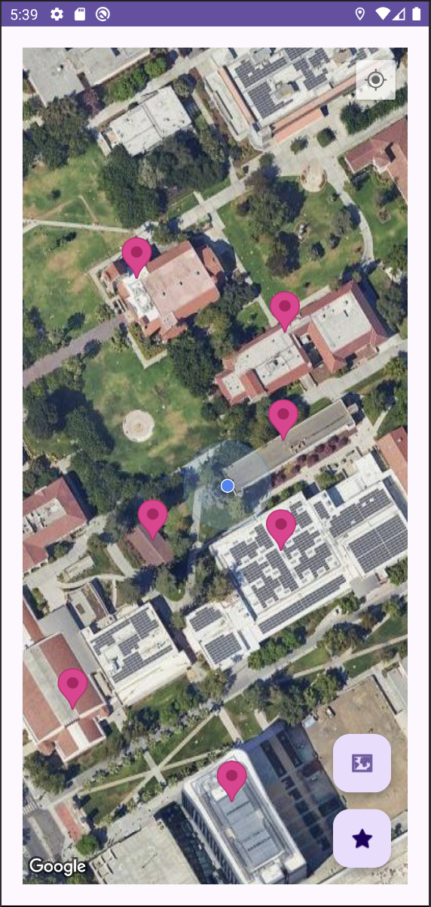
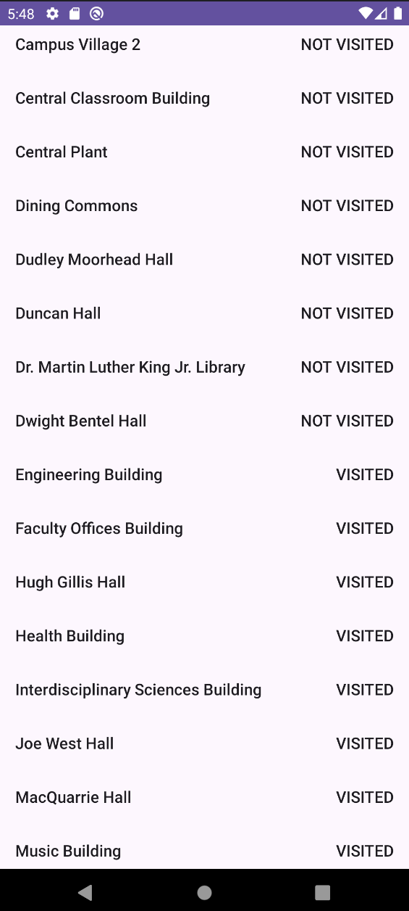
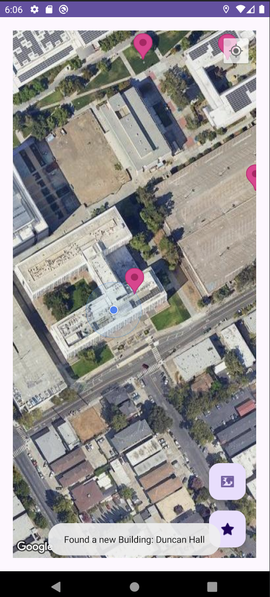

# APK
- Download it [here](https://drive.google.com/file/d/1qKXG2SOjn6jg9KuK3bkO_14lO0jM4Ttn/view?usp=sharing)

# Backlog
- 

# Final Report:
- App name: My Campus Explorer
- Group members' names:
    * Josh Dittmer
    * Anton Bogatyrev
    * Elias Keller
    * Het Tikawala
- Description: Come and explore the SJSU campus with My Campus Explorer! Discover buildings as you walk
    around the campus, and see the buildings that you have visited before. There are over 40 buildings to discover!
- Requirements: API 29+, 35 recommended, needs location permission.
- User Guide:
  - Below, you will find an image of the applications main screen:
  - 
  - The main screen allows you to:
    * See the various locations on the SJSU campus, denoted with red markers
    * Receive notifications whenever you visit a building for the first time
    * Jump to your location
    * Jump to SJSU's location
    * Access your list of visited locations
  - Clicking cross hairs button in the upper right corner will jump to your location
  - Clicking the star icon in the bottom right corner will jump to SJSU's location
  - Clicking the map icon in the bottom right corner will show a list of your visited locations:
  - 
  - Each location will be marked "VISITED" or "NOT VISITED" depending on if you've been there before.
  - Here's an example of a notification when you visit a building for the first time:
  - 

